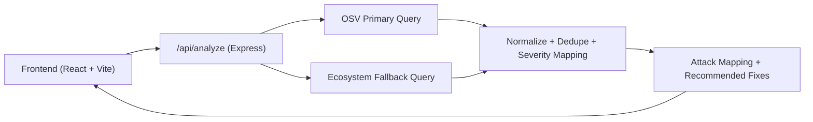

# StackSecure AI - DNX Command


[](https://react.dev/)
[](https://vitejs.dev/)
[](https://expressjs.com/)
[](https://api.osv.dev/)
[](#-license)

**StackSecure AI** is a cybersecurity analysis workspace that scans selected technologies, fetches live advisory intelligence, maps possible attack vectors, and recommends practical fixes.

---

## Table of Contents

- [Overview](#-overview)
- [Key Features](#-key-features)
- [Architecture](#-architecture)
- [Tech Stack](#-tech-stack)
- [Project Structure](#-project-structure)
- [Quick Start](#-quick-start)
- [API Reference](#-api-reference)
- [Severity Mapping](#-severity-mapping)
- [Scripts](#-scripts)
- [Deployment](#-deployment)
- [Roadmap](#-roadmap)
- [Contributing](#-contributing)
- [License](#-license)

---

## Overview

StackSecure AI helps teams validate risk in modern software stacks by turning raw vulnerability data into security insights:

- What vulnerabilities exist for selected versions
- Which attack classes are possible
- What should be fixed first

---

## Key Features

- Live OSV advisory lookups across multiple ecosystems
- Multi-source fallback strategy for stronger coverage
- Attack type classification:
  - `XSS`
  - `Injection`
  - `Auth Bypass`
  - `Path Traversal`
- Detailed attack insight cards with impact and first-action guidance
- Severity normalization for mixed advisory formats
- Clean, professional dashboard experience for analysis workflows

---

## Architecture



---

## Tech Stack

- **Frontend:** React, TypeScript, MUI, Vite
- **Backend:** Node.js, Express, CORS
- **Security Data:** OSV API

---

## Project Structure

```text
.
|-- server/
|   |-- index.js      # API server + vulnerability processing
|   `-- dev.js        # Runs API + Vite in one command
|-- src/
|   |-- pages/
|   |   `-- stack-analyzer/
|   |       |-- index.tsx
|   |       |-- TechGrid.tsx
|   |       `-- AnalysisOutput.tsx
|   `-- data/
|       `-- stackTechs.ts
|-- package.json
`-- vite.config.ts
```

---

## Quick Start

### Prerequisites

- Node.js `18+` (recommended `20+`)
- npm `9+`

### Install

```bash
npm install
```

### Start Full App (Frontend + API)

```bash
npm run dev
```

- Frontend: `http://localhost:5173`
- API: `http://localhost:4000`

### API Only

```bash
npm run api
```

### Production Build

```bash
npm run build
```

---

## API Reference

### `POST /api/analyze`

Analyze one technology/version pair and return vulnerabilities, attack mapping, and fixes.

**Request**

```json
{
  "techId": "nextjs",
  "tech": "next",
  "packageName": "next",
  "ecosystem": "npm",
  "version": "14.0.4"
}
```

**Response**

```json
{
  "vulnerabilities": [
    {
      "id": "GHSA-xxxx-xxxx-xxxx",
      "summary": "Advisory summary",
      "severity": "HIGH"
    }
  ],
  "attacks": ["XSS", "Injection"],
  "attackDetails": [
    {
      "attack": "XSS",
      "description": "Cross-site scripting details",
      "impact": "Likely impact",
      "firstAction": "Immediate remediation step",
      "evidence": [
        {
          "id": "GHSA-xxxx-xxxx-xxxx",
          "summary": "Matched advisory"
        }
      ]
    }
  ],
  "fixes": ["Update to latest version", "Sanitize inputs"],
  "dataSources": [
    {
      "source": "OSV",
      "packageName": "next",
      "ecosystem": "npm",
      "note": "Primary ecosystem query",
      "count": 17
    }
  ],
  "message": "Vulnerabilities found and mapped to security insights."
}
```

---

## Severity Mapping

- Uses advisory-provided severity when available (`LOW`, `MODERATE`, `HIGH`, `CRITICAL`)
- Derives severity from CVSS v3 vectors when plain labels are missing
- Includes runtime fallback logic for Node.js advisories (Debian package source path)

---

## Scripts

- `npm run dev` - Start frontend + backend
- `npm run web` - Start frontend only
- `npm run api` - Start backend only
- `npm run build` - Type-check and production build
- `npm run preview` - Preview built frontend
- `npm run lint` - Run lint checks

---

## Deployment

### GitHub

```bash
git push -u origin main
```

### Vercel

- Import this repository in Vercel
- Framework preset: `Vite`
- Build command: `npm run build`
- Output directory: `dist`
- Configure backend/API availability for production analysis requests

---

## Roadmap

- Additional advisory providers beyond OSV
- Persistent cache layer (Redis)
- API auth + rate limiting
- Exportable reports (JSON/PDF)
- Team-level audit and policy workflows

---

## Contributing

1. Fork the repository
2. Create a feature branch
3. Commit changes with clear messages
4. Open a pull request

---

## License

This repository is currently **unlicensed**.  
Add a `LICENSE` file before public distribution or commercial use.
